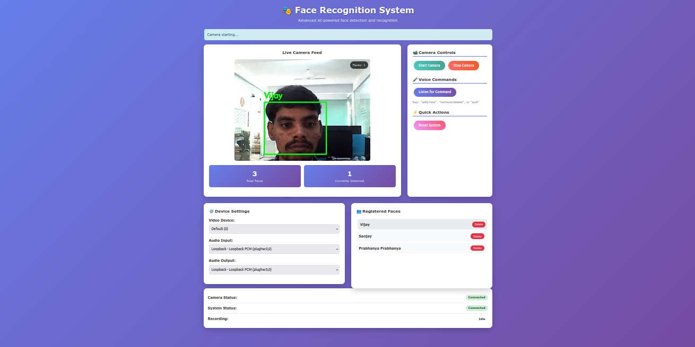

# Optimized Face Recognition System for i.MX8M Plus

 

This project implements an optimized face recognition system specifically designed for the i.MX8M Plus ARM processor (aarch64 architecture). It features real-time face detection and recognition with voice command capabilities, optimized for resource-constrained environments.

## Key Features

- 🚀 **Optimized for ARM**: Uses quantized TensorFlow Lite models (INT8) for efficient inference
- 🎤 **Voice Control**: Add/remove faces using voice commands
- 📷 **Real-time Video Processing**: Lightweight video pipeline with adjustable resolution
- 🔊 **Text-to-Speech Feedback**: Using lightweight espeak-ng engine
- 🧠 **Face Database**: Stores recognized faces with embeddings
- ⚡ **Performance Optimizations**:
  - Eventlet for async operations
  - Lazy model loading
  - Reduced video streaming (320x240 @ 5FPS)
  - Frame skipping to reduce CPU load

## Hardware Requirements

- i.MX8M Plus development board (or compatible ARM device)
- USB camera
- Microphone (for voice commands)
- Speakers (for audio feedback)

## Software Dependencies

- Python 3.8+
- OpenCV (compiled for ARM)
- NumPy
- Flask
- Flask-SocketIO
- Eventlet
- Whisper (tiny.en model)
- espeak-ng (for TTS)

## Installation

1. Clone this repository:
   ```bash
   git clone [https://github.com/yourusername/face-recognition-imx8m.git](https://github.com/12boopathi/flask_face_recognization_app.git)
   cd flask_face_recognization_app
   ```

2. Install Python dependencies:
   ```bash
   pip install -r requirements.txt
   ```

3. Install system dependencies (on Debian-based systems):
   ```bash
   sudo apt-get install espeak-ng ffmpeg libsm6 libxext6
   ```

## File Structure

```
face-recognition-imx8m/
├── database.npy                 # Face embeddings database
├── face_database.py             # Face database management
├── face_detection.py            # Face detection implementation
├── facenet_512_int_quantized.tflite  # Quantized FaceNet model
├── face_recognition.py          # Face recognition implementation
├── main.py                      # Main application entry point
├── templates/
│   └── index.html               # Web interface
└── yoloface_int8.tflite         # Quantized YOLO face detection model
```

## Usage

1. Run the application:
   ```bash
   python main.py
   ```

2. Access the web interface at `http://<your-device-ip>:5000`

3. Voice commands:
   - "Add" or "New" - Add a new face
   - "Remove" or "Delete" - Delete a face
   - "Quit" - Stop the camera

## Configuration

The system can be configured by modifying these constants in `main.py`:

```python
# Video settings (adjust for performance)
VIDEO_WIDTH = 320
VIDEO_HEIGHT = 240
VIDEO_FPS = 5
FRAME_SKIP = 0.2  # seconds between frames

# Audio settings
WHISPER_MODEL = "tiny.en"  # Speech recognition model
DEFAULT_AUDIO_DEVICE = "default"
DEFAULT_TTS_DEVICE = "default"

# Recognition settings
PADDING = 10  # Padding around detected faces
```

## Performance Tips

1. For better performance:
   - Reduce video resolution further if needed
   - Increase FRAME_SKIP value
   - Use a wired connection for the web interface

2. The system automatically:
   - Loads models in background
   - Skips frames when busy
   - Reduces video quality under load
